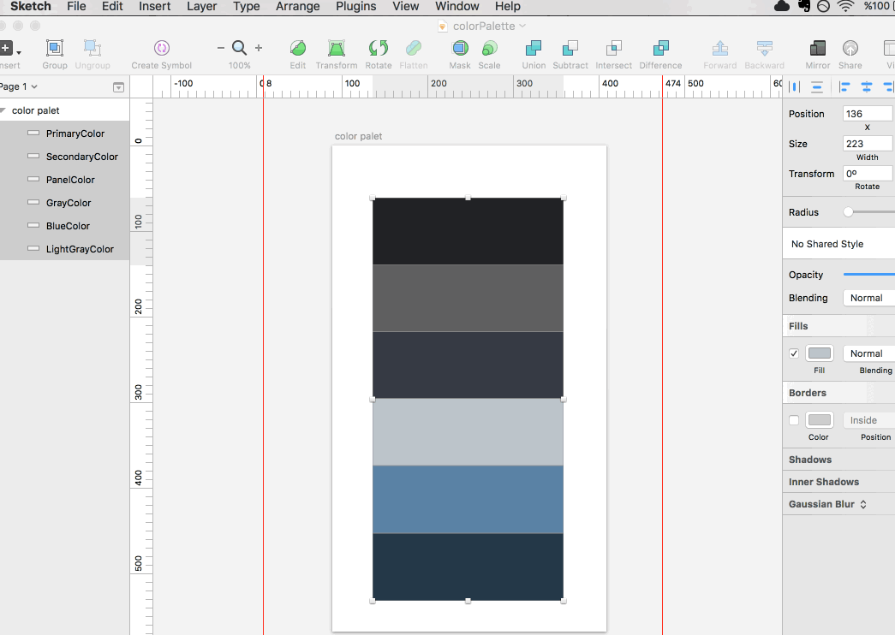

Swift Color Palette
=============================

A SketchApp plugin that making color palette an enum in other words generates Swift Color Theme files from your Sketch documents.  

Swift Color Palette plugin inspired by [**@NatashaTheRobot**](https://github.com/NatashaTheRobot) 's   [blog post](https://www.natashatherobot.com/swift-enum-no-cases/) 

Installation
=============================

[Download](https://github.com/nahitheper/SwiftColorPalette/archive/master.zip) and extract the contents of this repository. Then double-click the `SwiftColorPalette.sketchplugin` bundle to install the plugin.

Short Demo
=============================

 

Usage
=============================
* Rename color palette layer(s)
* Select a layer(s)
* Run using ```Plugins > Menu > Swift Color Palette```
* Select a Export File (optional)
* Click OK.

Example Code
=============================
```swift
enum ColorPalette {
    static let LightGrayColor =  UIColor(red:0.737, green: 0.769, blue: 0.792, alpha: 1.000)
    static let BlueColor =  UIColor(red:0.353, green: 0.510, blue: 0.647, alpha: 1.000)
    static let GrayColor =  UIColor(red:0.373, green: 0.373, blue: 0.376, alpha: 1.000)
    static let PanelColor =  UIColor(red:0.212, green: 0.227, blue: 0.267, alpha: 1.000)
    static let SecondaryColor =  UIColor(red:0.141, green: 0.220, blue: 0.282, alpha: 1.000)
    static let PrimaryColor =  UIColor(red:0.129, green: 0.133, blue: 0.145, alpha: 1.000)
}
```
